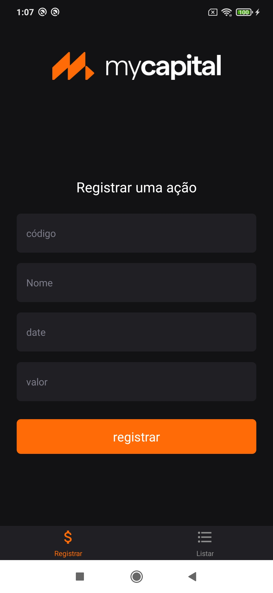

 <p align="center">
  
</p>

# About the project

The application consists of a screen that adds a code, name, date, value and another list screen, where information will be provided by context and storage.

## Layout mobile
<p align="center">
  
</p>

# Stack and Features

- React Native
- Typescript
- Expo Bare Workflow
- Context API
- Async Storage
- Tab navigation

# Running

```
$ yarn install 

Or

$ npm install
```
Start App

```
$ yarn start

$ yarn android
```


